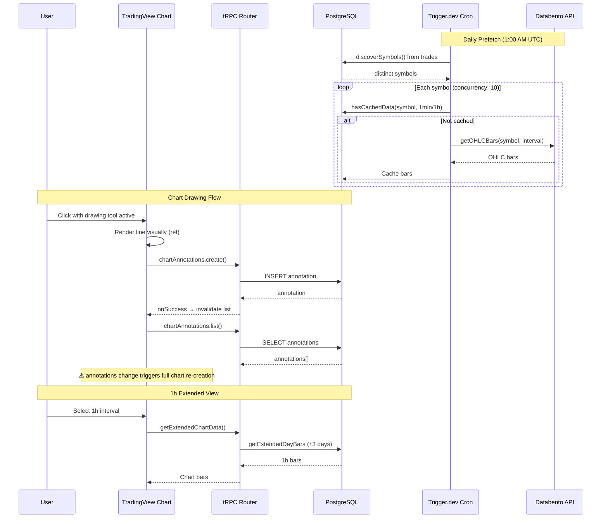

<h3>Greptile Summary</h3>

This PR adds three major features: a daily market data pre-fetch cron job (Trigger.dev), a 7-day 1h chart view with extended date range, and persistent drawing tools (horizontal/vertical lines) on trade charts with full CRUD backend.

- **Chart re-creation bug**: The main chart `useEffect` includes `annotations` in its dependency array. Since `createAnnotation.onSuccess` invalidates the annotations list query, every annotation placement triggers a full chart destroy-and-recreate cycle, causing visible flicker.
- **Missing soft-delete filter**: `discoverSymbols()` in the prefetch module queries all trades without filtering `isNull(trades.deletedAt)`, violating the project's established convention and causing unnecessary API calls for deleted trades' symbols.
- Backend annotations router follows project conventions well: uses `protectedProcedure`, validates trade ownership, guards `returning()` with error constants, and uses cascade deletes.
- Test coverage is solid: integration tests for annotations CRUD with ownership enforcement, prefetch logic with mocked services, and E2E smoke tests using `data-testid` selectors.
- No database migration file was generated for the new `chartAnnotations` table and enums — ensure `db:push` or a migration is run before deployment.

<h3>Confidence Score: 3/5</h3>

- Backend changes are solid, but the chart `useEffect` dependency on `annotations` will cause visible flicker on every annotation placement — a UX-impacting bug in the core feature.
- Score of 3 reflects that the backend (annotations CRUD, prefetch, extended chart endpoint) is well-implemented and follows project conventions, but the frontend has a significant UX issue where chart recreation on annotation placement will cause flicker. The missing soft-delete filter in `discoverSymbols` is a convention violation that could waste API calls. No security vulnerabilities found.
- `src/components/trade-detail/tradingview-chart.tsx` (chart re-creation on annotation placement), `src/lib/market-data/prefetch.ts` (missing soft-delete filter)

<h3>Important Files Changed</h3>

| Filename | Overview |
|----------|----------|
| src/components/trade-detail/tradingview-chart.tsx | Major chart component changes: adds drawing toolbar (horizontal/vertical lines), annotation persistence, keyboard shortcuts, and 1h extended view. The `annotations` dependency in the chart `useEffect` will cause full chart recreation on every annotation placement, resulting in visible flicker. |
| src/lib/market-data/prefetch.ts | New prefetch module for daily cron job. Well-structured with retry logic and concurrency limiting. Missing `isNull(trades.deletedAt)` soft-delete filter in `discoverSymbols` violates project conventions. |
| src/lib/market-data/service.ts | Adds `getExtendedDayBars` for fetching ~7 trading sessions of 1h data. Logic for date range calculation and parallel fetching is correct. Properly handles the today cap and data quality aggregation. |
| src/server/api/routers/chartAnnotations.ts | New CRUD router for chart annotations. Follows project conventions: uses `protectedProcedure`, validates trade ownership, guards `returning()`, and uses error constants. Minor: `color` input lacks format validation. |
| src/server/api/routers/marketData.ts | Adds `getExtendedChartData` endpoint for 1h chart view. Follows existing patterns, proper input validation with `z.iso.datetime()`, and correct timestamp conversion. |
| src/server/db/schema.ts | Adds `chartAnnotations` table with proper enums, relations, cascade deletes, indexes, and type exports. Follows project conventions with `createTable`, ID generator, and relation definitions. |
| src/trigger/daily-market-data-prefetch.ts | Thin Trigger.dev wrapper for the daily cron job. Clean separation of concerns — all logic lives in `prefetch.ts`. Runs at 1:00 AM UTC daily with concurrency limit of 10. |
| tests/integration/chart-annotations.test.ts | Comprehensive integration tests for chart annotations CRUD. Tests ownership enforcement, default values, and cross-user isolation. Uses real PostgreSQL via Testcontainers per project conventions. |
| tests/integration/daily-market-data-prefetch.test.ts | Integration tests for prefetch logic with mocked market data service. Covers empty symbols, dual-interval fetch, failure continuation, cache skip, and failure reporting. Follows lazy getter mocking pattern per project conventions. |
| tests/e2e/chart-tools.spec.ts | E2E smoke tests for chart drawing tools and 1h view. Properly uses `data-testid` selectors, handles missing trades gracefully with `test.skip`, and tests critical user journeys only per project conventions. |

<h3>Sequence Diagram</h3>

<!-- greptile_failed_comments -->

<h3>Comments Outside Diff (1)</h3>

1. `src/components/trade-detail/tradingview-chart.tsx`, line 1053-1070 ([link](https://github.com/nicolasgomeztoua/edgejournal/blob/65feac9eba2bfcb4e7ea84c082d7cdc08a1f8a9f/src/components/trade-detail/tradingview-chart.tsx#L1053-L1070)) 

   **Chart recreated on every annotation placement**

   The `annotations` query result is included in the chart `useEffect` dependency array (line 1067). When an annotation is created, `onSuccess` invalidates `chartAnnotations.list`, which causes `annotations` to refetch and change reference. This triggers the `useEffect` to re-run, destroying and recreating the entire chart — causing a visible flicker every time a user places a drawing.

   Consider either:
   1. Removing `annotations` from the dependency array and instead imperatively rendering persisted annotations via a separate `useEffect`, or
   2. Not invalidating the list query after create (since the annotation is already rendered visually via refs), and only refetching on component mount.

<!-- /greptile_failed_comments -->

Last reviewed commit: 65feac9
